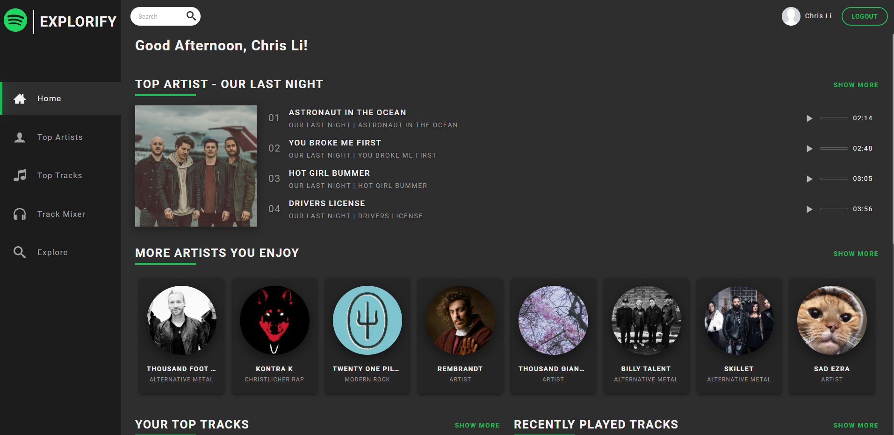
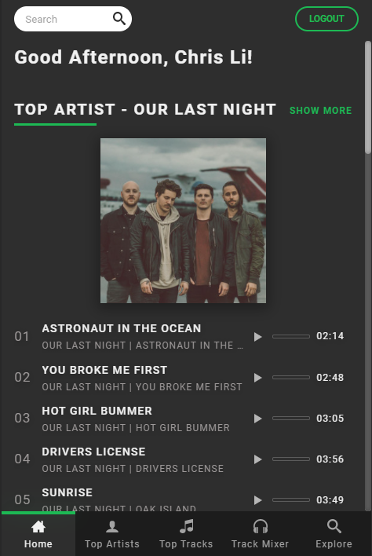
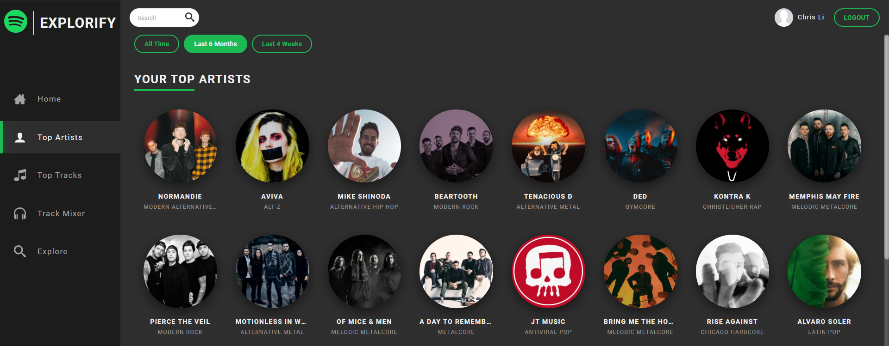
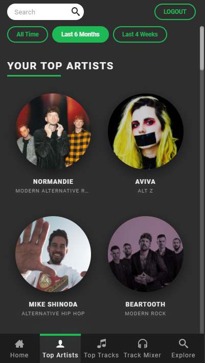
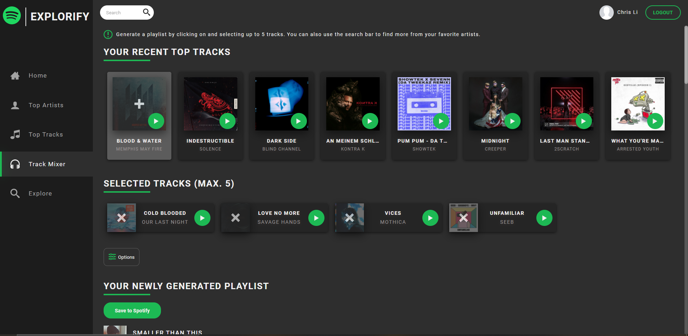
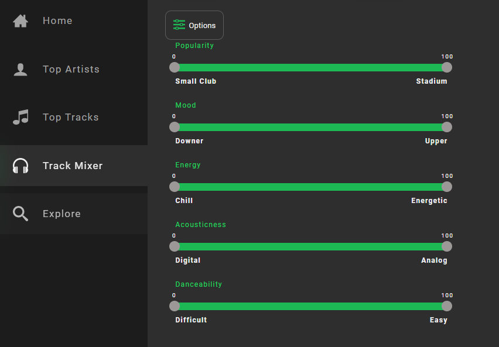

<!--
*** Thanks for checking out the Best-README-Template. If you have a suggestion
*** that would make this better, please fork the explorify and create a pull request
*** or simply open an issue with the tag "enhancement".
*** Thanks again! Now go create something AMAZING! :D
***
***
***
*** To avoid retyping too much info. Do a search and replace for the following:
*** chrislicodes, explorify, twitter_handle, email, Explorify, project_description
-->

<!-- PROJECT SHIELDS -->
<!--
*** I'm using markdown "reference style" links for readability.
*** Reference links are enclosed in brackets [ ] instead of parentheses ( ).
*** See the bottom of this document for the declaration of the reference variables
*** for contributors-url, forks-url, etc. This is an optional, concise syntax you may use.
*** https://www.markdownguide.org/basic-syntax/#reference-style-links
-->

<!-- PROJECT LOGO -->
<br />
<p>

  <h1>🎶 Explorify</h1>

  <p>
    React app to visualize your personalized Spotify data powered by the Spotify API.
    Explore your favorite Tracks, Artists, and Albums and use the
    Spotify recommendation engine to generate a personalized playlist by choosing up to five tracks. 
    <br /><br />
    <a href="https://app-explorify.herokuapp.com/home">View Demo</a>
    ·
    <a href="https://github.com/chrislicodes/explorify/issues">Explorify Bug</a>
    ·
    <a href="https://github.com/chrislicodes/explorify/issues">Request Feature</a>
  </p>
</p>

<!-- TABLE OF CONTENTS -->
<details open="open">
  <summary><h2 style="display: inline-block">Table of Contents</h2></summary>
  <ol>
    <li>
      <a href="#about-the-project">About The Project</a>
      <ul>
        <li><a href="#built-with">Built With</a></li>
      </ul>
    </li>
    <li>
      <a href="#getting-started">Getting Started</a>
      <ul>
        <li><a href="#installation">Installation</a></li>
      </ul>
    </li>
    <li><a href="#usage">Usage</a></li>
    <li><a href="#roadmap">Roadmap</a></li>
    <li><a href="#contributing">Contributing</a></li>
  </ol>
</details>

<!-- ABOUT THE PROJECT -->

## About The Project

|                   Desktop                   |                   Mobile                   |
| :-----------------------------------------: | :----------------------------------------: |
|  |  |

### Built With

- [React](https://reactjs.org/)
- [React-Router](https://reactrouter.com/)
- [Create React App](https://github.com/facebook/create-react-app)
- [axios](https://github.com/axios/axios)
- [swr](https://swr.vercel.app/)
- [Styled Components](https://styled-components.com/)
- [Express](https://expressjs.com/)
... and more
<!-- GETTING STARTED -->

## Getting Started

To get a local copy up and running follow these simple steps.

### Installation

1. Clone the explorify
   ```sh
   git clone https://github.com/chrislicodes/explorify.git
   ```
2. Install NPM packages in both root and client folder
   ```sh
   npm install
   ```
3. Register a Spotify App and add http://localhost:8080/callback as a Redirect URI in the app settings
4. Create an .env file in the root of the project based on example.env
5. Open two separate terminals and run
   ```sh
   npm run start-dev
   npm run client
   ```

<!-- USAGE EXAMPLES -->

## Usage

**Explore your favorite artists or tracks:**

|                      Desktop                      |                      Mobile                      |
| :-----------------------------------------------: | :----------------------------------------------: |
|  |  |

**Generate a personalized playlist:**



**Use the options to customize even further:**



<!-- ROADMAP -->

## Roadmap

- add tests
- rethink empty state design
- move to TypeScript

<!-- CONTRIBUTING -->

## Contributing

Contributions are what make the open source community such an amazing place to be learn, inspire, and create. Any contributions you make are **greatly appreciated**.

1. Fork the Project
2. Create your Feature Branch (`git checkout -b feature/AmazingFeature`)
3. Commit your Changes (`git commit -m 'Add some AmazingFeature'`)
4. Push to the Branch (`git push origin feature/AmazingFeature`)
5. Open a Pull Request

<!-- LICENSE -->
